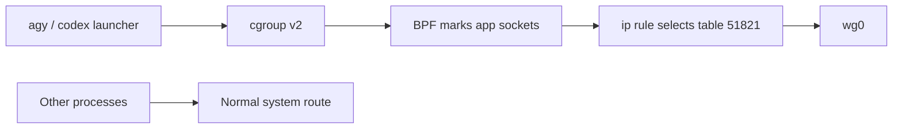

# Route selected Linux apps through WireGuard

This guide routes traffic from the `agy` and `codex` commands through a
WireGuard interface named `wg0`. Other applications continue to use the
system's normal route.

The example uses cgroup v2 and eBPF socket hooks to mark app sockets, then
Linux policy routing sends marked traffic through WireGuard. It does not use
provider IP lists, which can change and can be shared with unrelated services.

This is a Linux administrator recipe. It supports one or more configured Linux
accounts and requires a provider WireGuard profile with full-tunnel peer
`AllowedIPs`.

## Belarus use case

This setup is relevant to users in Belarus who cannot access Codex or Google
Antigravity directly. As of 2026-10-06, Belarus is not listed on OpenAI's
[supported countries page](https://help.openai.com/en/articles/7947663-chatgpt-supported-countries)
or Google Antigravity's [geographical availability page](https://antigravity.google/docs/faq).
Availability can change. Routing traffic through a VPN changes its network exit
point, but does not change account eligibility. OpenAI says access from outside
its supported countries may result in an account being blocked or suspended;
check current provider requirements before using this setup.

## Easier option for Windscribe users

Windscribe's Linux app advertises per-app split tunneling and support for
importing WireGuard configs. That can be simpler if using Windscribe's client
is acceptable. This guide uses `wireguard-tools` and `wg-quick` directly.

As checked on 2026-10-06, Windscribe lists Build-A-Plan from a $3/month
minimum, with locations at $1/month each. Pro is $9/month or $69/year
($5.75/month when billed yearly). Paid plans provide downloadable WireGuard
configs for included locations. Prices and plan details can change; check the
[official pricing details](https://windscribe.com/knowledge-base/articles/how-much-does-it-cost-to-use-windscribe).

Windscribe's [WireGuard config instructions](https://windscribe.com/knowledge-base/articles/where-do-i-access-my-wireguard-configs)
say configs are available to paid users, with Build-A-Plan limited to paid
locations. Its [Linux page](https://windscribe.com/features/linux) describes
Linux WireGuard support, custom configs, and per-app split tunneling.

## How the routing works



### What BPF does here

BPF means Berkeley Packet Filter. Linux's extended BPF (eBPF) lets the kernel
run small verified programs at defined hooks. This example attaches programs
to the per-user `agy-<username>` and `codex-<username>` cgroups. When one of those
processes opens an IPv4 or IPv6 connection, or sends a UDP datagram, the
program sets the socket mark `0x57474150`.

An `ip rule` matches that mark and looks up a separate route table whose
default route points to `wg0`. The ordinary main route remains in place for
other processes. The BPF program does not inspect domains, TLS, or application
payloads; it tags sockets based on the cgroup of the process that opened them.

If setting a socket mark fails, the BPF hook rejects the connect or UDP
sendmsg operation. When `wg0` goes down, the dedicated route is removed and a
following `prohibit` rule blocks marked traffic. This makes the recipe
fail-closed for the socket operations covered by the hooks.

## Requirements

- Linux with a unified cgroup v2 hierarchy mounted at `/sys/fs/cgroup`.
- Kernel support for BPF cgroup socket-address programs and the
  `bpf_setsockopt` helper.
- `wireguard-tools`, `iproute2`, `bpftool`, `clang`, and libbpf headers.
- A WireGuard provider profile with `AllowedIPs = 0.0.0.0/0`. Include
  `::/0` when the provider supports IPv6.
- `pkexec` with an active polkit authority on the system message bus. The
  example launchers use this for the one root-only cgroup move; they do not
  require `sudo`.
- Root access to install the helper and configure the interface.

Package names vary by distribution. The kernel must allow loading BPF programs;
some distributions require enabling BPF in their kernel config or granting the
relevant capabilities to the service that starts WireGuard.

## Install WireGuard tools

Install the distribution's WireGuard package before setting up `wg0`. These
packages provide `wg` and `wg-quick`, which this guide uses. The commands below
follow the [official WireGuard installation instructions](https://www.wireguard.com/install/).
If `sudo` is not installed, run administrative commands from a root shell; this
guide does not require installing `sudo` for app routing.

### Ubuntu

```sh
sudo apt update
sudo apt install wireguard
```

### Debian

```sh
sudo apt update
sudo apt install wireguard
```

For Debian releases older than Bullseye, enable the appropriate backports
repository first.

### Arch Linux

```sh
sudo pacman -S wireguard-tools
```

WireGuard is built into Linux kernels 5.6 and newer. For older kernels, use the
matching `wireguard-lts` or `wireguard-dkms` package and kernel headers.

### Fedora

```sh
sudo dnf install wireguard-tools
```

### Gentoo

```sh
emerge --ask net-vpn/wireguard-tools
```

The Gentoo ebuild's `wg-quick` USE flag controls installation of `wg-quick`;
check that it is enabled if the command is missing.

## Install

The commands below use `sudo` for brevity. If `sudo` is not installed, run
them from a root shell instead.

### 1. Build and install the BPF program and routing helper

From this repository:

```sh
./scripts/build-bpf.sh
sudo install -d -o root -g root -m 0755 /usr/local/libexec/wg-app-route
sudo install -o root -g root -m 0755 scripts/manage /usr/local/libexec/wg-app-route/manage
sudo install -o root -g root -m 0755 scripts/move-pid /usr/local/libexec/wg-app-route/move-pid
sudo install -o root -g root -m 0644 build/mark-sockets.bpf.o /usr/local/libexec/wg-app-route/mark-sockets.bpf.o
sudo install -o root -g root -m 0644 examples/wg-app-route.conf.example /etc/wg-app-route.conf
sudoedit /etc/wg-app-route.conf
```

Set `AGY_USERS` and `CODEX_USERS` to space-separated Linux account names. For
example, set `AGY_USERS='your-user'` and
`CODEX_USERS='your-user myuser'` when your regular account and a separate
Linux account named `myuser` should both run Codex through the VPN. Replace
these examples with your actual account names. The helper creates one cgroup
per app and account and gives it write access to the destination
`cgroup.procs` file.
Remove accounts from these lists when they should not use the VPN.

### 2. Allow the launcher to move its own process

On cgroup v2, an unprivileged process cannot always move itself by writing to
the destination `cgroup.procs`: the kernel also checks permissions at the
common ancestor of its current and destination cgroups. This guide uses a
root-owned `move-pid` helper to perform that one operation. The helper checks
the calling account, verifies that the PID belongs to that account and is
running the expected launcher, and only moves it into the app cgroup permitted
by `/etc/wg-app-route.conf`. The app itself continues running as its original
Linux user.

The launchers call the helper through `pkexec`. A small polkit rule authorizes
members of the `wg-app-route` group to run only this helper as root. This does
not grant a root shell or general root commands. The helper still checks that
the caller and PID match a configured app launcher. Do not add a service
account to `wheel` just to make `su` work.

Create the group, add every account listed in `AGY_USERS` or `CODEX_USERS`, and
install the example rule:

```sh
sudo groupadd --system wg-app-route
sudo usermod -aG wg-app-route your-user
sudo usermod -aG wg-app-route myuser
sudo install -o root -g root -m 0644 examples/wg-app-route.polkit.rules.example /etc/polkit-1/rules.d/50-wg-app-route.rules
```

Replace each placeholder with an account listed in `AGY_USERS` or
`CODEX_USERS`. Omit the `myuser` `usermod` command if you do not use a
separate account.
After changing group membership, start a new login session for each account.
The rule directory is provided by polkit; if it is missing, install the
distribution's polkit package. The system polkit authority and system message
bus must be running. Keep the `move-pid` helper owned by root and not writable
by app users.

To run Codex as your regular account, start `codex` from that account's shell.
The launcher keeps the same Linux user; it does not switch to `myuser` or
need that account's password. Use the separate account's launcher only when
you intend to run Codex as `myuser`.

Keep `ROUTE_MARK` at `0x57474150` unless you also update `WG_APP_MARK` in the BPF
source and rebuild the object. The config is shell syntax, so keep it owned by
root and unwritable by unprivileged users.

The build command requires `clang` with a BPF target and the libbpf development
headers. `bpftool` is used at runtime to load and attach the object.

### 3. Create a provider profile for `wg0`

Copy your provider's valid WireGuard profile to
`/etc/wireguard/wg0.conf`. Use
[`examples/wg0.conf.example`](examples/wg0.conf.example) as a guide and replace
every placeholder. Do not publish your real config.

For example, install the downloaded provider profile, then edit it:

```sh
sudo install -d -o root -g root -m 0700 /etc/wireguard
sudo install -o root -g root -m 0600 /path/to/provider.conf /etc/wireguard/wg0.conf
sudoedit /etc/wireguard/wg0.conf
```

Keep the provider's private key, addresses, peer public key, preshared key,
endpoint, and keepalive settings exactly as generated. Add `Table = off` and
the `PostUp` and `PreDown` hooks shown in the example. Remove the `DNS` line:
`wg-quick` applies that resolver setting system-wide, while this recipe routes
selected app sockets only. Set file permissions to `0600`.

`AllowedIPs = 0.0.0.0/0, ::/0` is shown for a provider that supports both
address families. Keep the provider's full-tunnel `AllowedIPs` values. The
helper requires IPv4 `0.0.0.0/0`; when `::/0` is missing, marked IPv6 traffic
is blocked by the fail-closed rule.

Do not run two copies of the same provider profile at once. If `wg0` reuses
the peer credentials from another interface such as `windscribe`, stop that
other interface first.

The WireGuard profile and routing-helper config stay system-wide. Do not copy
`/etc/wireguard/wg0.conf` or its private key into `/home/myuser`. Add `myuser`
to `CODEX_USERS` if that account should use Codex; the root helper creates its
cgroup when `wg0` starts.

### 4. Install and configure the launchers

Find the real executable paths before placing these wrappers on `PATH`.
Edit `real_command` in each launcher to point to the installed application
binary. For Codex, the example uses `/usr/bin/codex`; change it if your
installation is elsewhere. The `agy` path is intentionally a placeholder.
Never point a launcher at itself.

```sh
mkdir -p "$HOME/.local/bin"
cp launchers/agy launchers/codex "$HOME/.local/bin/"
chmod 0755 "$HOME/.local/bin/agy" "$HOME/.local/bin/codex"
```

Put `~/.local/bin` before system command directories in your shell `PATH`, for
example:

```sh
export PATH="$HOME/.local/bin:$PATH"
```

Install the launcher in each account's `~/.local/bin` and put that directory
first in each account's `PATH`. Repeat the copy and `chmod` commands while
logged in as the separate `myuser` account, or use the explicit commands in
the next section. Open a new login shell and check that `type -a codex` lists
the wrapper in `~/.local/bin` first. The wrapper moves its process into that
account's `codex-<username>` cgroup before starting the real executable.
Child processes inherit that cgroup.
Start Antigravity's CLI through `agy`; a GUI process started from a desktop
launcher is not covered by this example.

**Exit and restart any existing Codex process.** A process that started before
the wrapper was installed stays in its original cgroup. Opening a new shell
only matters when it makes the wrapper available in `PATH`; start Codex from
that shell so the wrapper can place the new process in the cgroup.

If starting `agy` prompts for a password, check that `type -a agy` lists
`~/.local/bin/agy` first and that this is the current launcher from this
repository. The launcher uses `pkexec` with the polkit rule above. An older
copy that runs `su -c` will ask for a password; replace it with the current
`launchers/agy`, set its `real_command` to the installed Antigravity CLI, and
restart Antigravity.

#### Install the Codex launcher for Linux user `myuser`

The wrapper must be present in `/home/myuser/.local/bin/codex` and that
directory must come before `/usr/bin` in the account's `PATH`. From the
repository, install it with:

```sh
sudo install -d -o myuser -g "$(id -gn myuser)" -m 0755 /home/myuser/.local/bin
sudo install -o myuser -g "$(id -gn myuser)" -m 0755 launchers/codex /home/myuser/.local/bin/codex
sudoedit /home/myuser/.profile
```

Add this line to the login startup file read by the `myuser` account's shell
(`/home/myuser/.profile` is common when no `.bash_profile` or
`.bash_login` takes precedence):

```sh
export PATH="$HOME/.local/bin:$PATH"
```

The WireGuard config and BPF route helper are shared system files; they do not
need copies in `/home/myuser`. Routing also works without copying a Codex
settings file. Codex keeps user preferences in `~/.codex/config.toml`. If you
want the same preferences, inspect the source first and copy only that file:

```sh
sudo install -d -o myuser -g "$(id -gn myuser)" -m 0700 /home/myuser/.codex
sudo install -o myuser -g "$(id -gn myuser)" -m 0600 "$HOME/.codex/config.toml" /home/myuser/.codex/config.toml
```

The config can include MCP or provider settings, so review it before copying.
After `wg0` is up, run `codex login` through the wrapper as Linux user
`myuser` to create that account's own login state. Do not copy authentication
tokens or auth files from another account. The official
[Codex config guide](https://developers.openai.com/codex/config-basic) describes
the per-user configuration location.

### 5. Start and stop the tunnel

Start the profile as root, using your system's service manager or:

```sh
wg-quick up wg0
```

Then launch `agy` or `codex` as one of the configured Linux users. Stop the
profile with:

```sh
wg-quick down wg0
```

The launchers refuse to start when the helper has not marked `wg0` ready.
When the tunnel is stopped, app sockets covered by the BPF hooks fail closed.
The helper leaves its BPF attachments and policy rules installed until reboot;
the empty route table plus `prohibit` rule blocks marked traffic while the
tunnel is down.

## Check the active route

As root, inspect the interface, policy rules, and app route table:

```sh
wg show wg0
ip -4 rule show
ip -6 rule show
ip -4 route show table 51821
ip -6 route show table 51821
```

For a running Codex process, inspect `/proc/<PID>/cgroup`. Its cgroup path
should end in `wg-app-route/codex-<username>` (for example,
`wg-app-route/codex-myuser` for the Linux account named `myuser`). Check
`type -a codex` in the shell used to launch it; the wrapper should be first.

Compare `wg show wg0 transfer` before and after a Codex request. Increasing
transfer counters show that traffic reached the WireGuard interface. If the
counters do not move, first confirm Codex was restarted through the wrapper
and that the wrapper points to the real executable.

## DNS and process boundaries

The application socket that asks a DNS question is marked by the BPF hook.
However, many Linux desktops send DNS to a local stub such as
`systemd-resolved` at `127.0.0.53`; that separate resolver process sends the
upstream query using its own sockets, outside the app cgroup. In that setup,
upstream DNS may use the normal route. Use a resolver arrangement that sends
queries directly from the app process or separately route the resolver if
DNS privacy through the VPN is required.

This method covers sockets opened by processes in the selected cgroups through
the attached IPv4/IPv6 connect and UDP sendmsg hooks. A separate daemon or
helper that performs network requests outside those cgroups does not inherit
the routing policy. Launching a process through its wrapper assigns the
cgroup at startup; existing processes are not moved automatically.

## Troubleshooting Codex 403 responses

First verify the process and route:

1. Restart Codex from a shell where the wrapper is first in `PATH`.
2. Confirm the Codex PID is in `wg-app-route/codex-<username>` under
   `/proc/<PID>/cgroup`.
3. Check that `wg0` has a recent handshake and that transfer counters
   increase during a request.

If transfer counters increase and Codex receives a 403, the request is using
the tunnel. A service may still reject the VPN exit address. For the specific
OpenAI Cloudflare “Sorry, you have been blocked” page, OpenAI says VPN use can
trigger an IP block and suggests trying another location or retrying later:
[OpenAI's troubleshooting article](https://help.openai.com/en/articles/7967834-why-am-i-getting-sorry-you-have-been-blocked-error).
Other 403 responses can have different causes; inspect the exact error and
redact tokens before sharing logs.

If the WireGuard counters do not increase, the running process may have been
started before routing was set up or outside the wrapper. Starting a new
shell alone does not move a running Codex process into the cgroup.

## Related reading

- [Official WireGuard installation instructions](https://www.wireguard.com/install/)
- [pkexec manual](https://polkit.pages.freedesktop.org/polkit/pkexec.1.html)
- [polkit authorization rules](https://polkit.pages.freedesktop.org/polkit/polkit.8.html)
- [WireGuard quick start](https://www.wireguard.com/quickstart/)
- [`wg-quick(8)`](https://man7.org/linux/man-pages/man8/wg-quick.8.html), including `Table = off` and hooks
- [`ip-rule(8)`](https://man7.org/linux/man-pages/man8/ip-rule.8.html)
- [Linux cgroup v2 documentation](https://docs.kernel.org/admin-guide/cgroup-v2.html)
- [Linux BPF documentation](https://docs.kernel.org/bpf/)
- [Linux BPF helper functions](https://docs.kernel.org/bpf/helpers.html)
- [Windscribe pricing details](https://windscribe.com/knowledge-base/articles/how-much-does-it-cost-to-use-windscribe)
- [Windscribe WireGuard config instructions](https://windscribe.com/knowledge-base/articles/where-do-i-access-my-wireguard-configs)
- [Windscribe Linux features](https://windscribe.com/features/linux)
- [Codex user configuration](https://developers.openai.com/codex/config-basic)
- [OpenAI supported countries](https://help.openai.com/en/articles/7947663-chatgpt-supported-countries)
- [Google Antigravity geographic availability](https://antigravity.google/docs/faq)
- [Process-scoped cgroup/eBPF route research: ProcRoute (2026)](https://arxiv.org/abs/2604.16080)
- [WireGuard with network namespaces, an alternative design](https://www.procustodibus.com/blog/2023/04/wireguard-netns-for-specific-apps/)

The research paper and namespace guide cover related designs. This repository
provides a hands-on `wg-quick` example for process-scoped socket marking and
policy routing.
